## Modul Golang

Pre Requirements:

-   Kemampuan Dasar Bahasa Pemrograman C.

-   Menginstall Visual Studio Code

# Modul Hari Pertama
### Daftar Isi
- [Modul Hari Pertama](#modul-hari-pertama)
    - [Daftar Isi](#daftar-isi)
  - [1. Install Golang (approx +- 20 min)](#1-install-golang-approx---20-min)
  - [2. Integrasi Visual Studio Code dengan Go](#2-integrasi-visual-studio-code-dengan-go)
  - [3. Syntax Dasar dan Cara Menjalankan Go](#3-syntax-dasar-dan-cara-menjalankan-go)
  - [4. Syntax Dasar dan Pemahaman Go](#4-syntax-dasar-dan-pemahaman-go)
    - [4.1 Fungsi](#41-fungsi)
    - [4.2 Variable](#42-variable)
    - [4.3 Flow Control](#43-flow-control)
    - [4.4 Array](#44-array)
    - [4.5 Struct](#45-struct)
    - [4.6 Defer](#46-defer)
    - [4.7 Method](#47-method)
    - [4.8 Public/Private/Protected Identifier](#48-publicprivateprotected-identifier)
    - [4.9 Pointer](#49-pointer)
    - [5.0 Pointer Receiver.](#50-pointer-receiver)
    - [5.1 Interfaces](#51-interfaces)
    - [5.2 Empty Interface](#52-empty-interface)
    - [5.3 Map](#53-map)
    - [5.4 Errors](#54-errors)
## 1. Install Golang (approx +- 20 min)

1.  Buka [https://golang.org/doc/install](https://www.google.com/url?q=https://golang.org/doc/install&sa=D&source=editors&ust=1617499705407000&usg=AOvVaw3yR2qwJ_3zpWD8rUUq0fiK)

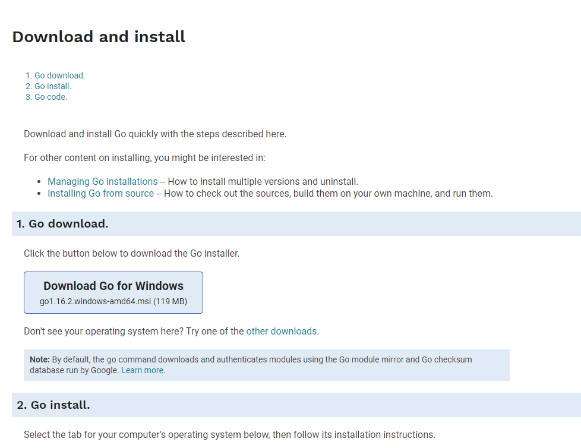

2. Klik Download Go For Windows(Bagi yang OS Windows)
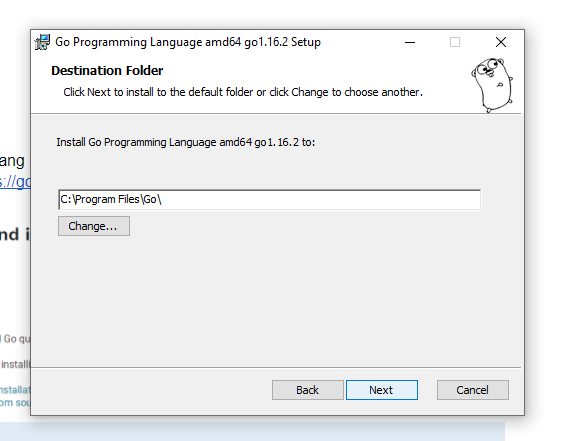
   - Sesuaikan lokasi file dengan yang digambar, Lalu plih **Next** dan **Install**.
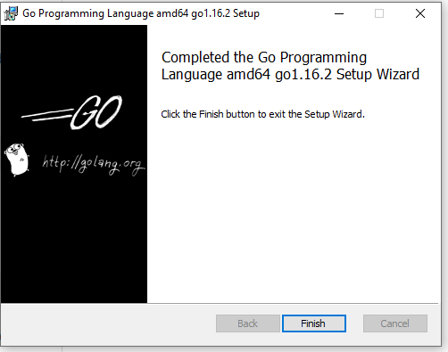
   - Tampilan Go telah selesai diinstall.
   - Cek apakah go telah terinstall dengan menggunakan command `$ go version`.


3.  Instalasi Linux
    -  sudo wget [https://golang.org/dl/go1.16.2.linux-amd64.tar.gz](https://www.google.com/url?q=https://golang.org/dl/go1.16.2.linux-amd64.tar.gz&sa=D&source=editors&ust=1617499705409000&usg=AOvVaw0U-IXHQZep3CWl_NcemuLF)  
    -  `rm -rf /usr/local/go && tar -C /usr/local -xzf go1.16.2.linux-amd64.tar.gz`  
    -  Buka file ~/.profile, lalu tambahkan baris berikut ke akhir file :  
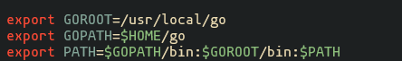
    -  Simpan lalu restart terminal anda.  
    -  Cek apakah go telah terinstall dengan menggunakan command `$ go version`.

4.  Instalasi Mac
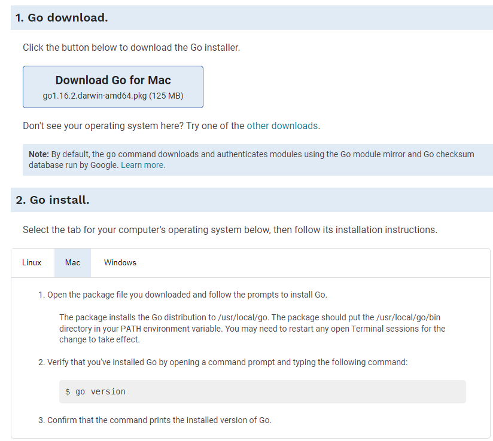
    - Pilih tab **Mac**  sesuai gambar.  
    - Download file dengan **Download Go For Mac**.  
    - Jangan lupa menambahkan path environment Go yaitu /usr/local/go/bin ke PATH environment variable  
    - Cek apakah go telah terinstall dengan menggunakan command `$ go version`.

## 2. Integrasi Visual Studio Code dengan Go
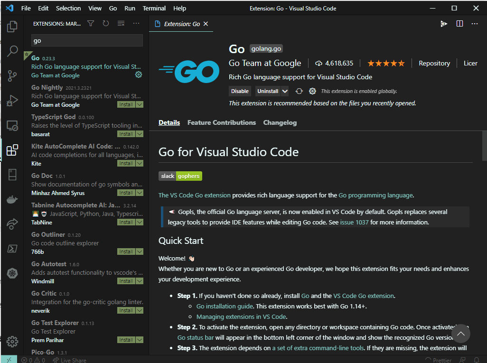
1.  Install plugin sesuai gambar diatas. Lalu restart VS Code kalian.
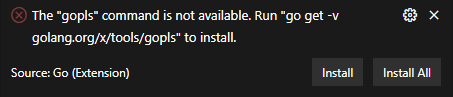
2.  Jika disuruh menginstall plugin pada Go, maka pilih opsi Install All.

## 3. Syntax Dasar dan Cara Menjalankan Go

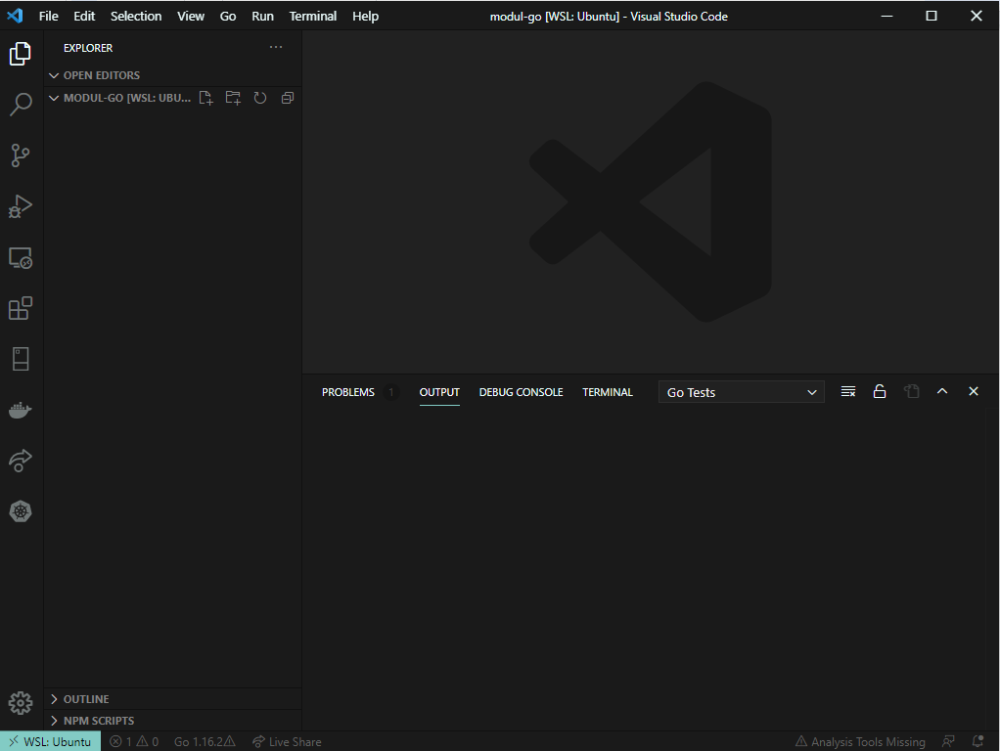
1.  Buat sebuah folder baru dan bukalah folder tersebut di **VSCode** kalian. Pada gambar diatas, nama folder adalah modul-go.
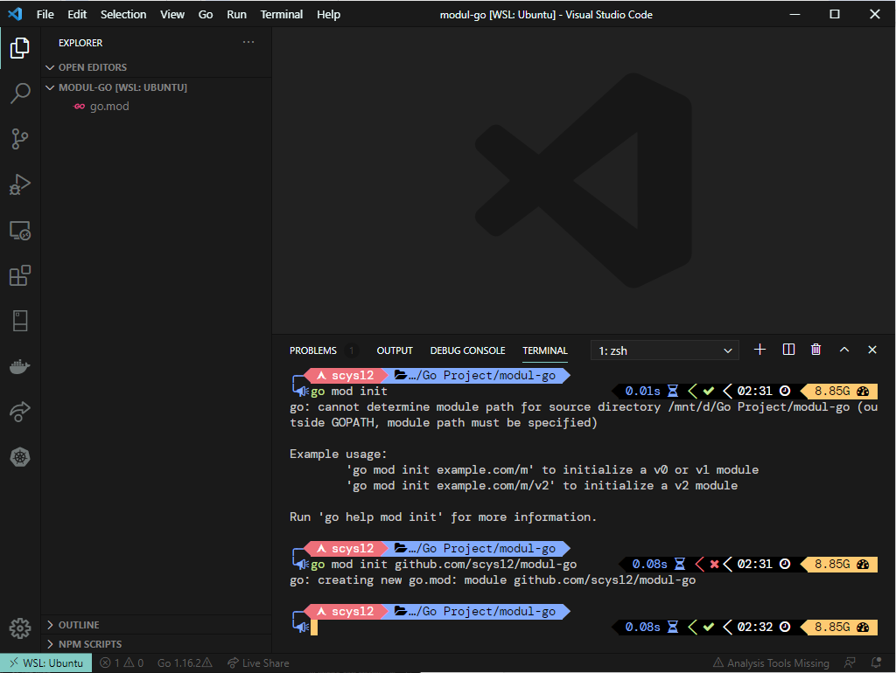
2.  Untuk membuat suatu projek berbasis Go baru tanpa harus membuat mengaturnya pada $GOPATH, anda harus menginisiasi sebuah module dimana module ini berperan sebagai penanda bahwa di folder tersebut merupakan sebuah module untuk projek Go. Hal ini sangat berperan penting dalam pengembangan Go, karena jika kalian tidak membuat module pada folder baru ini, kalian wajib membuat folder pada lokasi file Go diinstall, dan itu membuat konfigurasi yang sangat susah.

&nbsp;&nbsp;&nbsp;&nbsp;&nbsp;&nbsp;&nbsp;&nbsp;Dalam hal ini kita menjalankan perintah `go mod init example.com/m`. Jika melihat lebih dalam lagi untuk penamaan nama module biasanya mengikuti {nama_domain}/{tim/user_pembuat}/{nama_project}. Pada contoh diatas dapat dilihat bahwa nama modulnya **github.com/scys12/modul-go** dimana modul tersebut berada di github.com dengan nama pembuat scys12 dan modul bernama modul-go. Nama modul ini berarti sebagai identifier, yang akan dibahas lebih lanjut pada topik selanjutnya.

3.  Ketika anda telah menginisiasi module, maka akan dibuat file baru bernama **go.mod**

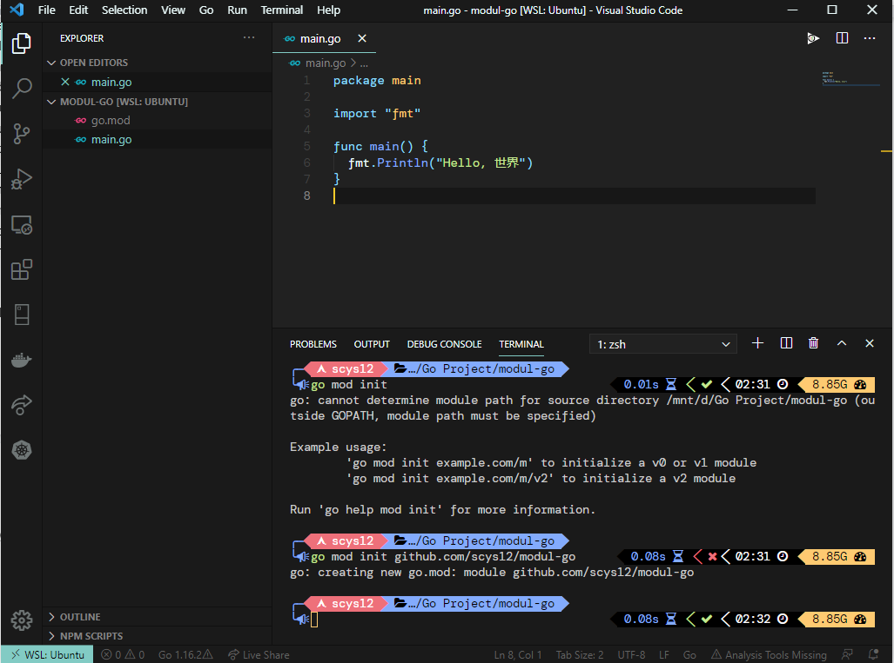

4.  Buatlah file **main.go**.  

Struktur file go biasanya wajib memiliki **package {package_name}** dimana nama package itu menandakan file tersebut berada di folder yang mana. Ketika ingin menggunakan library yang tersedia pada Go, penulisannya seperti berikut `Import "library_name"`, jika hanya satu library. Jika lebih dari satu library,
````GO
    Import (
    "Library_name1"
    "library_name2"
    )
````
Tapi tenang saja, karena ketika anda menggunakan plugin VSCode Go, maka plugin tersebut akan mengatur penulisan file Go anda.
-   Agar suatu file go berjalan wajib memiliki
**package main**


Dengan nama fungsi
````GO
func main (){
...
}
````

-   Jika suatu file memiliki func main(), maka Go akan mengeksekusi programnya melalui fungsi tersebut.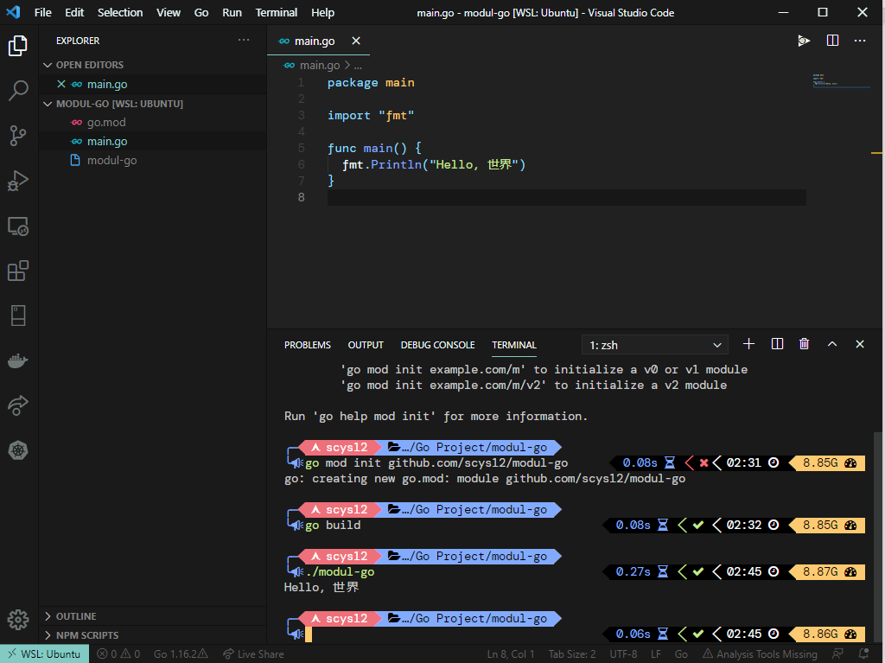

5.  Untuk mengeksekusi suatu projek Go, anda dapat melakukannya dengan perintah

``go build``

```./{root_name_folder}```

Jika melihat dari gambar diatas, hasil dari perintah build akan menampilkan file baru yang namanya sesuai dengan base root folder, dimana dari gambar tersebut adalah modul-go. Jika anda menggunakan windows, dapat menjalankan program dengan perintah :

 ``{root_name_folder.exe}``

Lalu akan ditampilkan hasil dari program anda. Dari gambar diatas, program kita menampilkan

    Hello, 世界

## 4. Syntax Dasar dan Pemahaman Go

###  4.1 Fungsi

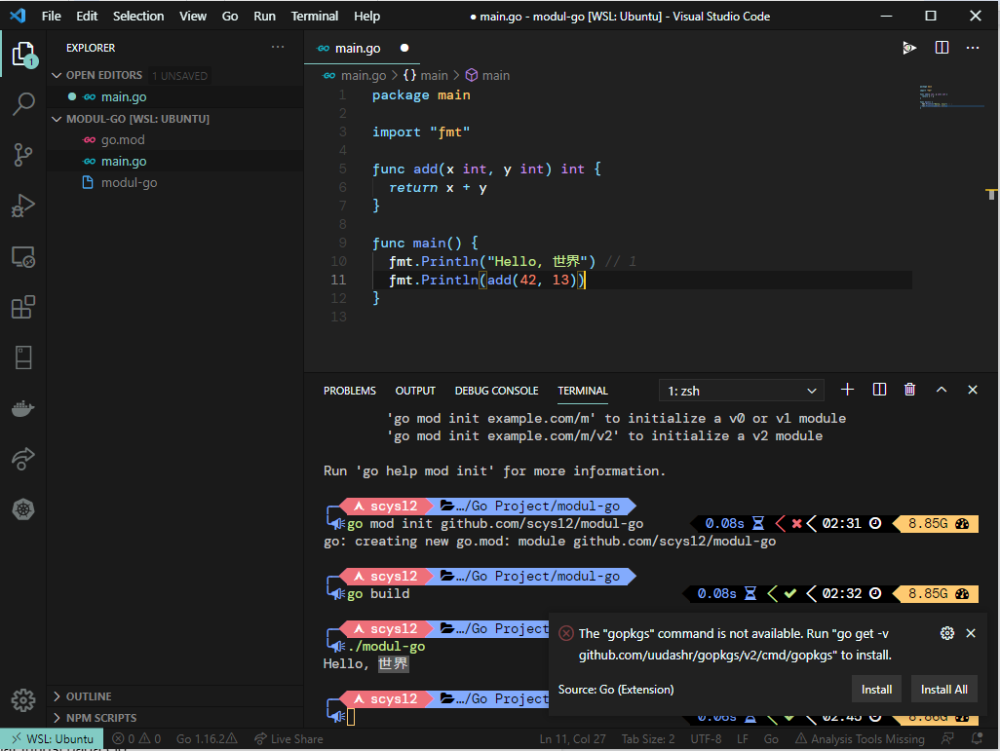

- Untuk membuat fungsi pada Go, anda dapat menggunakan syntax
````GO
func nama_fungsi(param_name data_type, param_name2 data_type,...) return_type {
...
}
````

- Untuk fungsi yang tidak mengembalikan suatu nilai, maka return_type dapat dikosongi. Pada contoh diatas, membuat fungsi bernama add dengan parameter x dan y yang mengembalikan x+y dimana x+y merupakan integer.

   Untuk mengeksekusi agar hasil penjumlahan tersebut terlihat dapat menjalankan :

```go build```  
``./{root_folder_name}``

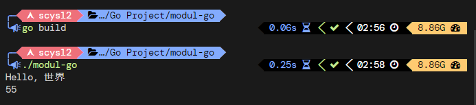

Contoh lain:

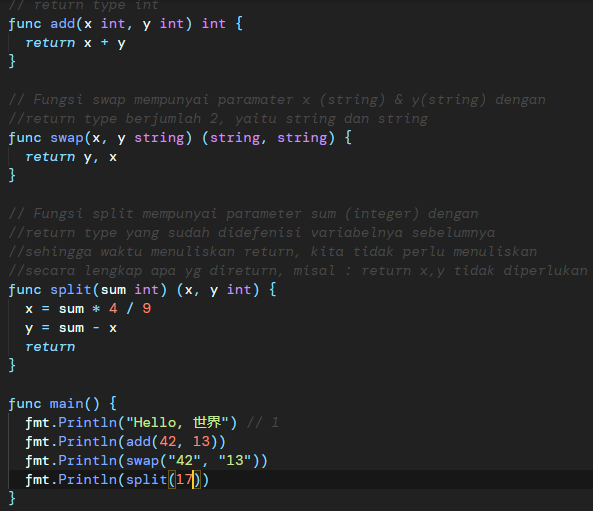

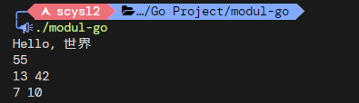

###  4.2 Variable

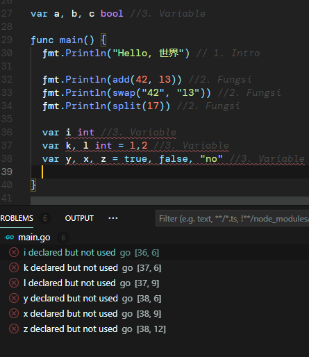

- Ketika ingin mendefinisikan variable dapat menggunakan syntax

````GO
var variable_name data_type
````

Namun variable ini belum didefinisikan nilainya. Atau kalian bisa dengan menggunakan
````GO
var variable_name = value
````
Dimana kita tidak perlu menuliskan type data, namun wajib memberi assignment terhadap variable tersebut.

Dapat dilihat, terdapat error yang muncul karena kita mendefinisikan suatu variable namun tidak menggunakannya. Go merupakan bahasa yang sensitif terhadap variablenya, jika ada variable yang didefinisikan tapi tidak digunakan, maka akan menampilkan error, sehingga cara terbaik yaitu dengan memastikan bahwa variable tersebut diassignment nilainya.

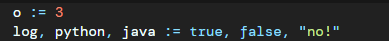

- Terdapat suatu cara untuk mendefinisikan variable beserta valuenya yaitu dengan menggunakan tanda “**:=**”
````GO
var_name := value
````
### 4.3 Flow Control

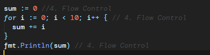

Ketika ingin menggunakan **for** dalam Go, anda dapat mendefinisikannya seperti gambar diatas.

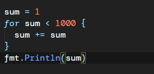

Sedangkan untuk penggunaan **while**, Go tidak menyediakan syntax tersebut namun digantikan dengan **for** seperti gambar diatas.

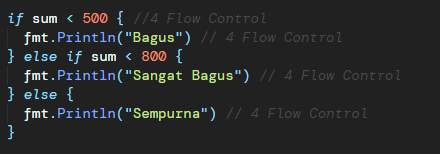

Terdapat **if/else** yang merupakan percabangan atau condition blocks. **If** akan bergantung pada hasil yang ingin dibandingkan.

### 4.4 Array

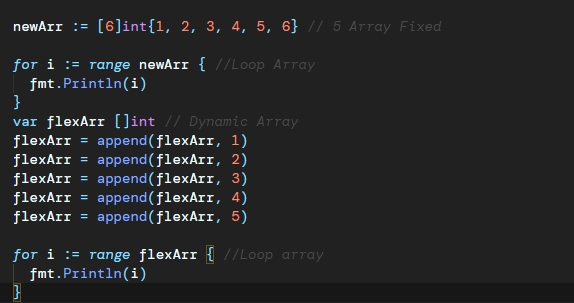

Apa itu **Array**? **Array** adalah sebuah struktur data yang terdiri atas banyak variabel dengan tipe data sama, dimana masing-masing elemen variabel mempunyai nilai indeks. Kalian dapat membuat fixed-length array dengan menetapkan berapa ukuran dari array, dengan syntax
````GO
[size_n]data_type{val1, val2, val3,..., valn}
````
Kalian juga dapat membuat array dynamic dimana kalian tidak perlu menetapkan ukuran dari array tersebut. Salah satu cara mendeklarasikan array dynamic :
````GO
var variable_name [ ]data_type
````
Dan kalian dapat menambahkan value dari array tersebut dengan fungsi **append()**.

### 4.5 Struct
Struct adalah kumpulan definisi variabel (atau property) dan atau fungsi (atau method), yang dibungkus sebagai tipe data baru dengan nama tertentu. Property dalam struct, tipe datanya bisa bervariasi. Mirip seperti **map**, hanya saja key-nya sudah didefinisikan di awal, dan tipe data tiap itemnya bisa berbeda. Struct mirip dengan **Class** di **OOP**.

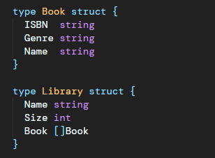

Dari kodingan diatas, kita mempunyai **Struct** `Book`  yang mempunyai field `ISBN`, `Genre`, `Name` dengan tipe String. Lalu kita mempunyai **Struct** `Library` dengan field `Name` (string), `Size`(int), Lalu kita mempunyai array of struct dari **Struct** `Book`.

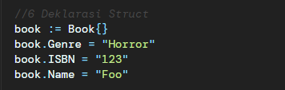

Kalian dapat mendeklarasikan struct seperti kodingan diatas.

`Book := Book{}` dapat dikatakan bahwa kita membuat suatu struk baru. Jika dikonversikan ke OOP Class, maka :

    Book book = Book()

Dimana kita tidak menaruh parameter pada konstruktornya

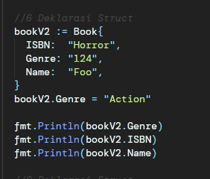

Pada deklarasi struk diatas, kita mendeklarasi sekaligus mengisi value dari field field pada struct `Book`. Jika terdapat suatu field yang tidak diisi, maka default valuenya bisa berupa **nil**, **0**. **Nil** pada **Go** berarti  suatu variable belum memiliki value sama sekali. **Nil** mirip dengan **Null** pada bahasa pemrograman lainnya. Jika kodingan diatas dikonversikan ke OOP Class, maka :

    Book bookV2 = Book(“Horror”, “124”, “Foo”)

Dimana pada class Booknya menjadi :
````Java
class Book {
	Book(string isbn, string genre, string name){
		This.isbn = isbn
		This.genre = genre
		This.name = name
	}
}
````
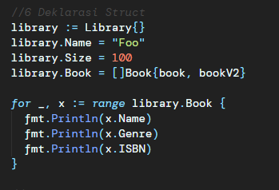

Untuk mendeklarasikan struct `Library`, kalian dapat membuat seperti kode diatas, atau

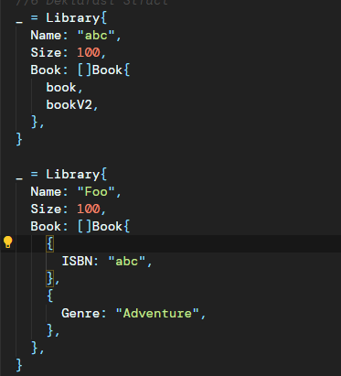

Perbedaannya adalah pada gambar pertama, struct buku sudah kita assign ke variable book dan bookV2, sedangkan gambar kedua, kita mengisi `Book` tanpa mengassign ke variable.

### 4.6 Defer

Defer merupakan syntax untuk mengeksekusi statement pada saat fungsi melakukan pengembalian.

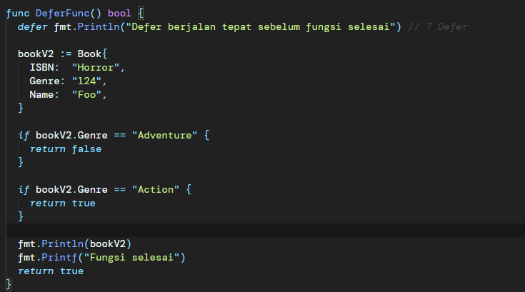

Kita mempunyai fungsi bernama DeferFunc() dengan return value berupa **boolean**.

Kegunaan defer adalah untuk memastikan suatu statement benar benar dijalankan. Dapat dilihat bahwa disana kita mengecek genre bukunya. Bagaimana kita bisa memastikan bahwa sebelum fungsi melakukan return, dia akan mengeksekusi suatu statement? Kita dapat memastikan dengan menggunakan defer.

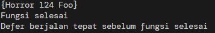

Output dari fungsi diatas.

### 4.7 Method
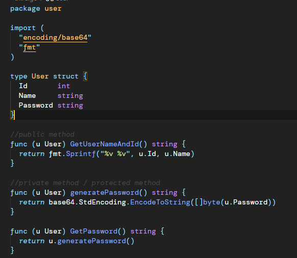

Apa itu method ? Method sama seperti function, namun yang membedakan method mempunyai receiver argument, dimana receiver argumen itu menandakan method tersebut dimiliki oleh struktur data yang mana.

Dari gambar diatas kita mempunyai struct `User`. Lalu kita mempunyai 3 Method dasri struct User yaitu **GetUserNameAndId()**, **generatePassword()**, **GetPassword()**.

Kenapa 3 fungsi ini dibilang method, karena mereka mempunyai receiver, yaitu (u user).

````GO
Func (receiver_name receiver_type) function_name(param1,...,paramn
````
Statement diatas adalah cara membuat method.

### 4.8 Public/Private/Protected Identifier
Mungkin kalian bertanya-tanya, gimana caranya membuat public/private/protected seperti yang ada di bahasa pemrograman OOP lainnya. Di Go,tidak ada terminologi yang menerangkan bagaimana membuat public/private/protected, melainkan dengan menggunakan huruf besar atau huruf kecil. Agar suatu variable/struct/fungsi/method dianggap sebagai public identifier, harus menggunakan huruf besar pada awalan nama. Sehingga kita bisa memanggil dari **package** yang berbeda. Sedangkan jika menggunakan huruf kecil pada awalan nama, maka akan dianggap protected dan private. Lebih lanjut suatu variable/struct/fungsi/method dianggap private ketika dia tidak dapat diakses dari **package diluar package dari file tersebut (didefinisikan dibaris paling atas).** Sedangkan protected dianggap ketika kita bisa mengakses dari package yang sama dengan package file. Jadi walaupun terdapat 2 file berbeda namun masih satu package, maka kita bisa mengakses variable/struct/fungsi/method karena dianggap protected.

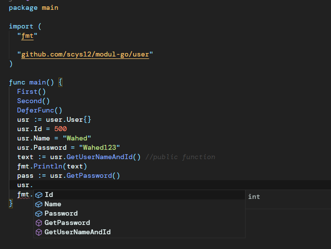

Struct `User` berada di package `user`, dan kita ingin memanggil melalui package **main**. Dapat dilihat bahwa, fungsi yang muncul hanya fungsi berawalan huruf besar, sedangkan fungsi yang berawalan huruf kecil tidak dapat diakses dari luar package.

### 4.9 Pointer

Pointer menyimpan alamat-alamat pada Go. Pointer sangat penting ketika menggunakan Go.

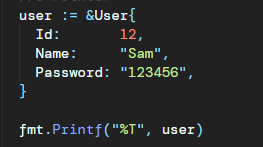

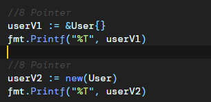

Kita dapat mendeklarasikan variable yang menggunakan pointer seperti kodingan diatas. Kita dapat menggunakan new(), atau menggunakan tanda “&” pada waktu deklarasi.

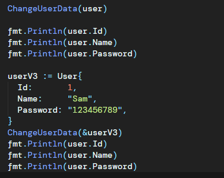

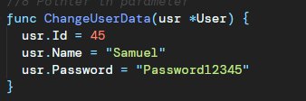

Pointer juga dapat digunakan sebagai parameter, dimana variable yang kita passing juga harus dalam bentuk pointer. Jika dilihat bahwa `user` sudah dalam bentuk pointer (Gambar Sebelumnya)  sehingga jika kita passing ke fungsi **ChangeUserData()** maka dapat berjalan. Dapat dilihat bahwa fungsi **ChangeUserData**, kita hanya perlu mengganti isi dari struct kita tanpa melakukan return.

Jika kita awalnya mendeklarasikan variable tanpa menggunakan pointer yaitu variable `userV3`, ketika kita ingin passing ke fungsi **ChangeUserData()** maka dapat menggunakan tanda “&” diparameter fungsi tersebut.

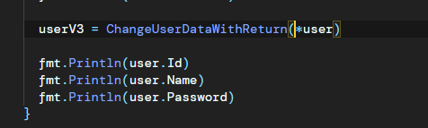

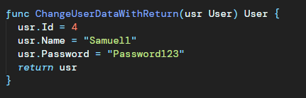

Ketika kita ingin mempassing suatu variable berpointer ke dalam fungsi yang tidak menggunakan pointer, maka kita dapat menggunakan tanda “*” di variable yang ingin dipassing
### 5.0 Pointer Receiver.
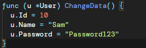

Pada kode diatas kita membuat receiver menggunakan pointer, yaitu `(u *User)`. Ada 2 alasan kenapa kita harus menggunakan pointer receiver.

Yang pertama adalah agar method dapat mengubah value dari field2 di receivernya

Yang kedua adalah menghindari menyalin nilai pada setiap panggilan metode. Ini bisa lebih efisien jika receiver adalah sebuah struct besar
>**Rule Of Thumb:** Ketika kalian tidak yakin terhadap apa yang akan receiver kalian lakukan, gunakan pointer.

### 5.1 Interfaces
Interfaces adalah kumpulan dari method-method yang akan menjadi. Suatu struct dikatakan mengimplementasi suatu interface jika dia mengimplementasi semua method dari interface tersebut

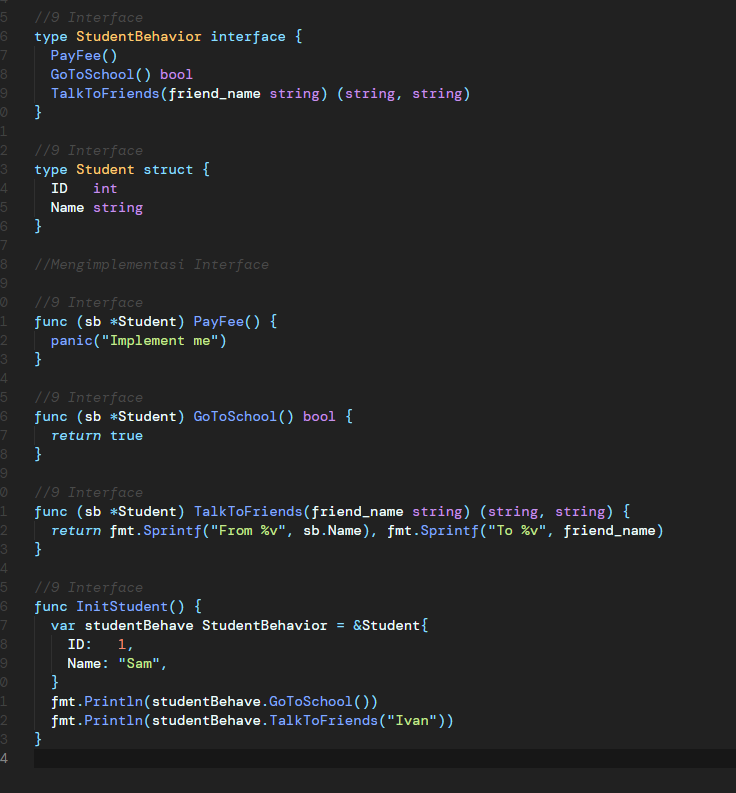

Dapat dilihat bahwa kita membuat interface StudentBehavior yang methodnya berhubungan dengan yang biasanya murid-murid lakukan. Lalu kita membuat struct student yang fieldnya berupa ID dan Name. **Untuk mengimplementasikan interface pada struct terjadi secara implisit,** dimana kita tidak perlu menuliskan **implements** seperti yang ada di Java misalnya, namun wajib **menuliskan semua method dari interface tersebut sama persis** ke method dari struct.

Contohnya adalah terdapat 3 fungsi pada interface StudentBehavior yaitu:

**PayFee()  
GoToSchool() bool  
TalkToFriends(friend_name string) (string, string)**  

Untuk mengimplementasi fungsinya di Student struct dibuat method dengan nama yang sama persis dengan yang ada di interface StudentBehavior.


Untuk menggunakan interface, dapat dilihat pada kodingan

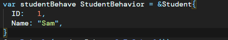

Dimana polanya adalah :

````GO
var var_name Interface_Name = struct_implemented{}
````

Kita dapat membuat struct dengan menggunakan pointer (&) atau tidak. Jika ada salah satu pointer receiver yang menggunakan struct, maka wajib menggunakan tanda (&) pada saat deklarasi variable. Jika tidak ada pointer receiver, hanya menggunakan receiver biasa, maka dapat memilih untk mendeklarasi dengan menggunakan pointer(&) atau tidak.

### 5.2 Empty Interface
Adalah tipe interface yang tidak memiliki method sama sekali. Kita dapat menyimpan nilai apapun dalam empty interface. Dapat dibilang bahwa ini mirip dengan Object yang ada di java atau **dynamic** yang ada di dart.

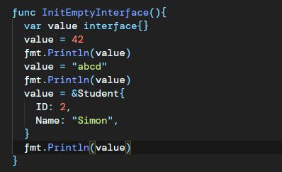

Dapat dilihat bahwa value mempunyai tipe interface{}/empty interface. Sehingga kita bisa mengassign nilai apapun kedalamnya. Kita juga dapat memakai empty interface pada fungsi. Contohnya adalah fmt.Print

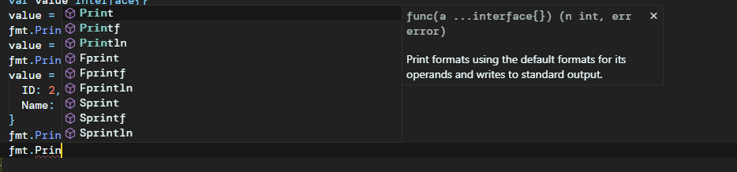

### 5.3 Map
Map adalah suatu struktur data yang memetakan key ke value

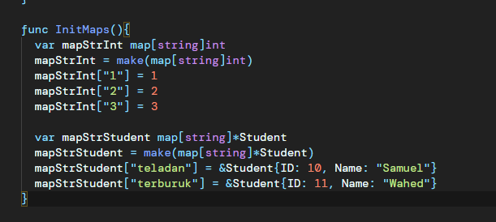

Dapat dilihat bahwa kita membuat mapStrInt yang mempunyai struktur data map[string]int

Dimana keynya merupakan string dan valuenya merupakan integer.

**Inisialisasi map dengan menggunakan make(map_type)**

Kita bahkan bisa menginisialisasi map dengan value/key sebuah struct

### 5.4 Errors

Salah satu kelebihan go adalah kita tidak perlu menghafal tipe error seperti yang ada di Java, contohnya adalah IOException, RuntimeException, dll. Sebab setiap fungsi di go dapat mereturn error dimana kita bisa mengecek error tersebut

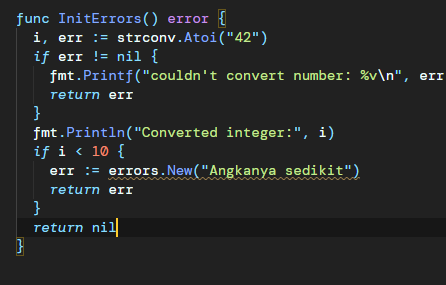

Dapat dilihat diatas bahwa kita ingin mengubah string “42” menjadi integer. Kita bisa melakukannya dengan menggunakan package **strconv** dengan fungsi **Atoi**

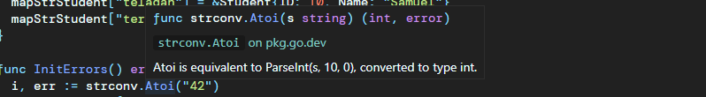

Fungsi Atoi mengembalikan (int,error) dimana parameter 1 merupakan hasil dari konversi “42”, sedangkan error untuk mengecek apakah ketika melakukan convert terjadi error. Jika fungsi mereturn error, **kita wajib untuk mengecek apakah terdapat error dengan cara**
````GO
 If err != nil{
 ...
 }
````
Yang berarti bahwa jika variable err tidak kosong yang berarti terdapat isinya yang merupakan error, maka terjadi kesalahan pada kode kalian. Contohnya diatas, jika kita menaruh string **“hallo”** pada strconv.Atoi sehingga menjadi strconv.Atoi(“hallo”) tentunya akan menghasilkan error. Sehingga variable err akan diassign suatu error.

Kita bahkan dapat dengan mudah membuat custom error sendiri. Dapat dilihat dari kodingan diatas yaitu:
````GO
Err  := errors.New(“Angkanya sedikit”)
````
Itu merupakan custom error. Custom error dapat dibuat melalui package **errors**.