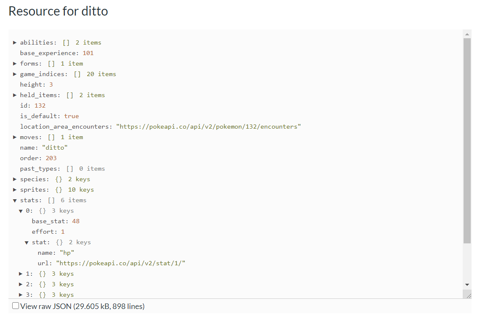
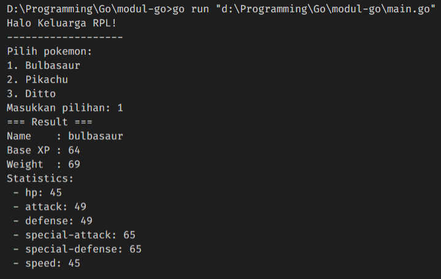

# **Mini Project Golang: Pokemon CLI**

## Pendahuluan

Pada miniproject kali ini, akan dibahas mengenai cara melakukan _fetch_ API pada pemrograman Go.

Kebutuhan pembuatan miniproject Pokemon CLI:

-   API (diambil pada link [Pokemon API](http://pokeapi.co))
-   Pemahaman struct dan input output pada Go.

### Daftar Isi

-   [Mini Project Golang](#-**mini-project-golang:-pokemon-cli**)
-   [Pendahuluan](#-pendahuluan)
-   [Daftar Isi](#daftar-isi)
-   Proses Project
    -   [Awalan Project](#-proses-1:-awalan-project)
    -   [Pengolahan API](#-proses-2:-pengolahan-api)
    -   [Mengambil Data Response ke Variabel Struct Go](#-proses-3:-mengambil-data-response-ke-variabel-struct-go)

## Proses 1: Awalan Project

Kita perlu membuat isian pertanyaan pada program CLI.

```
fmt.Println("Halo Keluarga RPL!")
fmt.Println("-------------------")
fmt.Println("Pilih pokemon:")
fmt.Println("1. Bulbasaur")
fmt.Println("2. Pikachu")
fmt.Println("3. Ditto")
fmt.Printf("Masukkan pilihan: ")
```

Setelahnya, kita dapat langsung memasukkan standar input di dalam Go. Untuk melakukannya, tambahkan package "bufio" serta sama seperti _Scanner class_ pada Java, kita melakukkan passing fungsi _NewReader_ ke variabel reader.

```
// Inisialisasi reader
reader := bufio.NewReader(os.Stdin)
```

Berlanjut ke memanggil data input ke method _ReadRune_ di mana memanggil data berupa rune atau char. Keluaran dari method tersebut adalah rune, size, dan error.

```
// Membaca input
char, _, err := reader.ReadRune()

if err != nil {
    fmt.Println(err)
    os.Exit(1)
}
```

## Proses 2: Pengolahan API

Kita berlanjut membuat string url dari API yang akan dibuat. Pada contoh kali ini, kita memakai url dari "http://pokeapi.co/api/v2/pokemon/" sebagai API-nya. Switch case juga dipakai sebagai if condition.

```
// Base URL
url := "http://pokeapi.co/api/v2/pokemon/"

// Ganti URL berdasar input
switch char {
case '1':
    url += "bulbasaur"
case '2':
    url += "pikachu"
case '3':
    url += "ditto"
default:
    url += "pikachu"
}
```

Lalu, kita lakukan fetch dengan package "http" dengan fungsi Get() serta tidak lupa untuk cek errornya.

```
// Fetch api
response, err := http.Get(url)
if err != nil {
    fmt.Print(err.Error())
    os.Exit(1)
}
```

Berlanjut ke mengambil json dari hasil _response fetching_. Di sini dipakai package "ioutil" dengan method ReadAll.

```
// Ambil response
responseData, err := ioutil.ReadAll(response.Body)
if err != nil {
    log.Fatal(err)
}
```

## Proses 3: Mengambil Data Response ke Variabel Struct Go

Sebelum mengubah data response ke struct, kita perlu untuk membuat struct sesuai dengan bentuk dari JSON API.

Gambaran JSON adalah berikut.


Sehingga, kita ubah ke struct seperti berikut.

```
// Struct untuk membantu parsing
type Response struct {
	Name           string  `json:"name"`
	BaseExperience int     `json:"base_experience"`
	Weight         int     `json:"weight"`
	Stats          []Stats `json:"stats"`
}

type Stats struct {
	BaseStat int         `json:"base_stat"`
	Stat     PokemonStat `json:"stat"`
}

type PokemonStat struct {
	StatName string `json:"name"`
}
```

Selanjutnya, dilakukan parsing dari json ke struct dengan menggunakan package "json" dan method Unmarshal.

```
// Parsing response
var responseObject Response
json.Unmarshal(responseData, &responseObject)
```

Hasilnya lantas kita tampilkan sebagai berikut.

```
fmt.Printf("=== Result ===\n")
fmt.Printf("Name\t: %v\n", responseObject.Name)
fmt.Printf("Base XP\t: %v\n", responseObject.BaseExperience)
fmt.Printf("Weight\t: %v\n", responseObject.Weight)
fmt.Printf("Statistics:\n")
for i := 0; i < len(responseObject.Stats); i++ {
    fmt.Printf(" - %v: %v\n", responseObject.Stats[i].Stat.StatName, responseObject.Stats[i].BaseStat)
}
```

Hasil suksesnya akan menjadi seperti berikut.


Mudah, kan? Selamat mencoba.
